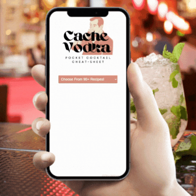

  
  
  

I'm a Software Engineer with a focus on Full Stack Web Applications, with a background in Art, Music, and Technical/Customer Support. I love building with creatives and business owners.
Check out [my main site](https://dionwilson.dev)!

<h1 align="center">Projects</h1>
<table bordercolor="#66b2b2">

<tr>
    <td width="50%" valign="top">
      <h3 align="center">Beauty Unlimited By Kye LLC</h3>
         
        
         
        
          
    
  
      

        
<strong>HTML5, CSS3, & Javascript</strong>::This fully responsive website serves as a hub for listing services, scheduling appointments, receiving feedback, and directing customers to social media. Beautiful on both mobile and desktop, giving the client a competitive edge against similar businesses in the area.

    </td>
  
  <td width="50%" valign="top">
      <h3 align="center">Cache Vodka</h3>
         
        
         
        
          
    
  
      

        
<strong>HTML5, CSS3, & Javascript</strong>::Built for mobile, Cache Vodka is a vodka lover's cocktail recipe cheat-sheet. Quickly look up over 90 alphabetically listed drinks. Each includes a list of ingrediants with measurements, a small photo for reference, simple directions, and even the type of glass to serve your creations in.

    </td>
    
  </tr>
  
  <tr>
    <td width="50%" valign="top">
      <h3 align="center">A NASA APOD Archive</h3>
       
        
       
        

  
  
      

        
<strong>HTML5, CSS3, & Javascript</strong>::Since 1995, NASA has published an Astronomy Picture Of The Day. This page, automotically showing you last year's entry on load, gives the ability to browse all previous entries from NASA by simply picking a date from the calander menu and choosing select. All images are HD sourced using official NASA API integration.

    </td>
    <td width="50%" valign="top">
      <h3 align="center">Syra Sprarkle Photography</h3>
         
       
         
        

          
  
  
      

        
<strong>HTML5, CSS3, & Javascript</strong>::A landing page for Syra Sparkle, New York based international photographer with a passion for nightlife and underground culture. Easily navigate to their book shop, portfolio, social media, and donation pages.

    </td>
  </tr>
</table>

<h1 align="center">Technologies</h1>

    
    
    
    
    
    
     
    

---

<h1 align="center">Connect</h1>

  
  
  

